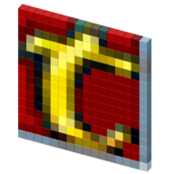

<div align="center">
	
	<h1>Quiz</h1>
</div>


## :dart: Objetivo

A [Alura](https://www.alura.com.br/) propôs a criação de uma aplicação para aplicar os conceitos do nextjs, framework que vem ganhando espaço no mercado nos últimos tempos.

Foram 5 aulas do dia 25 ao 29, apresentando conceitos do React e Nextjs, como os instrutores trazendo sua visão de mercado e boas práticas.

Sendo assim a ideia é construir um app de perguntas e respostas, o famigerado Quiz. O tema do projeto é livre, decidi fazer um quiz sobre o tibia, jogo de MMORPG europeu criado em 1997 pela Cipsoft.

## :hammer_and_wrench: Ferramentas

-   [Nextjs](https://nextjs.org/)
-   [Styled Components](https://styled-components.com)
-   [Styled Icons](https://styled-icons.js.org/)
-   [Vercel](https://vercel.com)
-   [Npm](https://www.npmjs.com/)

## :desktop_computer: Padronização de código

-   [Eslint](https://eslint.org/)
-   [Prettier](https://prettier.io/)
-   [EditorConfig](https://editorconfig.org/)

## :art: Animações

-   [Motion](https://www.framer.com/motion/)

## :rocket: Executando o projeto

➡️ **Download do projeto**
```bash
git clone https://github.com/Lubrum/tibiaquiz-base.git
```
➡️ **Acessando a pasta do projeto depois do clone do projeto**
```bash
cd tibiaquiz-base
```

➡️ **Instalando Dependências**
```bash
npm install
```
➡️ **Iniciando o projeto**
```bash
npm start
```

## :eyeglasses: Demo em produção

[Link de acesso :dizzy:](https://tibiaquiz-base.vercel.app/)
